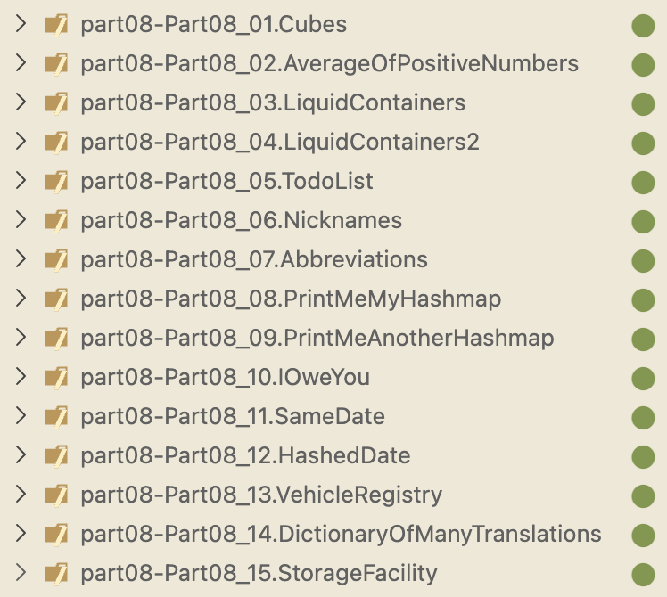
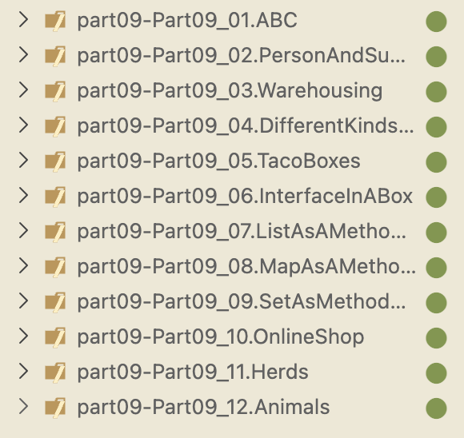
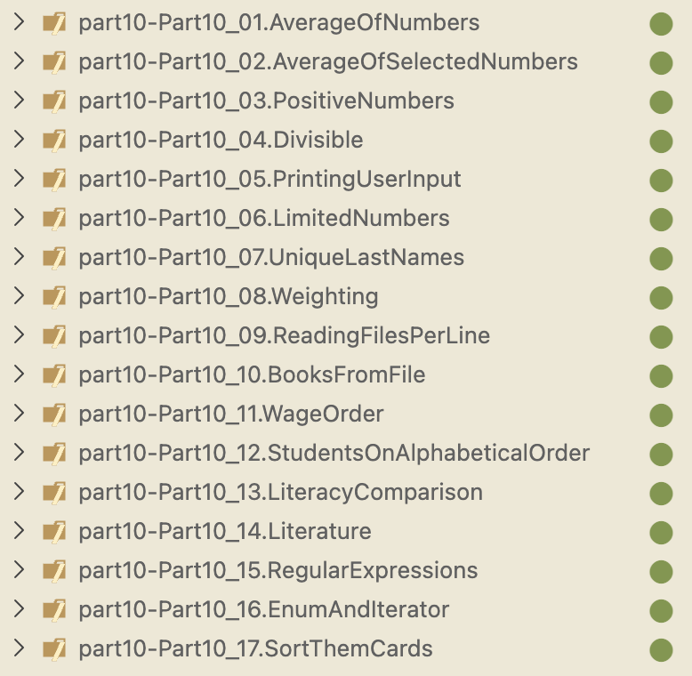

# Java-Programming
Contains the progress on learning java

### Part - 8
In this part:

    1. Short recap
    2. Hash Map
    3. Similarity of objects
    4. Grouping data using hash maps
    5. Fast data fetching and grouping information



### Part - 9
In this part:

    1. Class inheritance
    2. Interfaces
    3. Object polymorphism
    4. Summary



### Part - 10
In this part:

    1. Handling collections as streams
    2. The Comparable Interface
    3. Other useful techniques
    4. Summary



Read this example later :

## Last problem of Part - 10 (Quick Revision of useful Techniques on comparisons):

This exercise packed several core Java OOP ideas together.

You started with a simple **domain object**: `Card`.

A `Card` has:

```java
value
suit
```

and a readable `toString()`.

That’s just basic class modeling.

---

Then came **Comparable**.

You made:

```java
Card implements Comparable<Card>
```

which means:

> A Card knows how to compare itself with another Card.

You defined the **natural/default ordering**:

first by value:

```text
2 < 3 < ... < A
```

and if equal value:

by suit:

```text
CLUB < DIAMOND < HEART < SPADE
```

using:

```java
compareTo()
```

Big idea:

**Comparable = built-in/default sorting logic for the object itself.**

Because of that, Java could now do:

```java
Collections.sort(cards)
```

without extra instructions.

---

Then you built **composition** with `Hand`.

A hand is not a card.

A hand _contains_ cards:

```java
ArrayList<Card>
```

This is object composition:

```text
Hand HAS-A list of Cards
```

You added behavior:

```java
add()
print()
```

So objects became not just data containers, but behavior containers.

---

Then sorting the hand.

Since cards already know their ordering through:

```java
compareTo()
```

sorting hand became simple:

```java
Collections.sort(this.cards)
```

Key learning:

If contained objects are `Comparable`, the container can easily sort them.

---

Then you made **Hand itself comparable**.

Now not only cards can be compared, but whole hands.

You defined a helper:

```java
handValue()
```

which sums card values.

Then:

```java
Hand implements Comparable<Hand>
```

with:

```java
compareTo()
```

based on total hand value.

Big idea:

Any class can become sortable/comparable if you define comparison logic.

Now Java can compare:

```java
hand1.compareTo(hand2)
```

---

Then came the important limitation.

A class gets only **one natural ordering**.

For cards, natural ordering was:

```text
value first, then suit
```

But what if you want:

```text
suit first
```

You don’t want to rewrite `compareTo()`.

That introduced **Comparator**.

---

You created:

```java
Comparator<Card>
```

which means:

> external comparison logic

instead of the object deciding.

This is alternate sorting behavior.

Difference:

`Comparable`

```text
object compares itself
one default order
```

`Comparator`

```text
external comparer
many possible orders
```

---

Then custom comparator logic.

You built:

```java
BySuitInValueOrder
```

which reversed comparison priority:

instead of:

```text
value → suit
```

it became:

```text
suit → value
```

Same comparison pattern, different priority.

This is a powerful design pattern:

**primary comparison**  
if equal:  
**secondary comparison**

---

Then sorting with a comparator.

Instead of:

```java
Collections.sort(cards)
```

you used:

```java
Collections.sort(cards, comparator)
```

Meaning:

> Don’t use natural ordering.  
> Use this custom ordering instead.

Then inside `Hand`:

```java
sortBySuit()
```

used that comparator.

---

Design-wise, this exercise taught:

**Class design**

```text
Card
Hand
```

---

**Composition**

```text
Hand contains Cards
```

---

**Enums**

```java
Suit
```

with:

```java
ordinal()
```

for ordering.

---

**Comparable**

default object ordering.

---

**Comparator**

alternate ordering strategies.

---

**Collections.sort()**

sorting using either:

natural order:

```java
Collections.sort(list)
```

or custom comparator:

```java
Collections.sort(list, comparator)
```

---

**Encapsulation**

`handValue()` hidden as helper logic.

---

**Comparison contract**

negative:

```text
this before other
```

positive:

```text
this after other
```

zero:

```text
equal
```

---

This was really a mini lesson in how Java models behavior-rich objects.

### Part - 11

